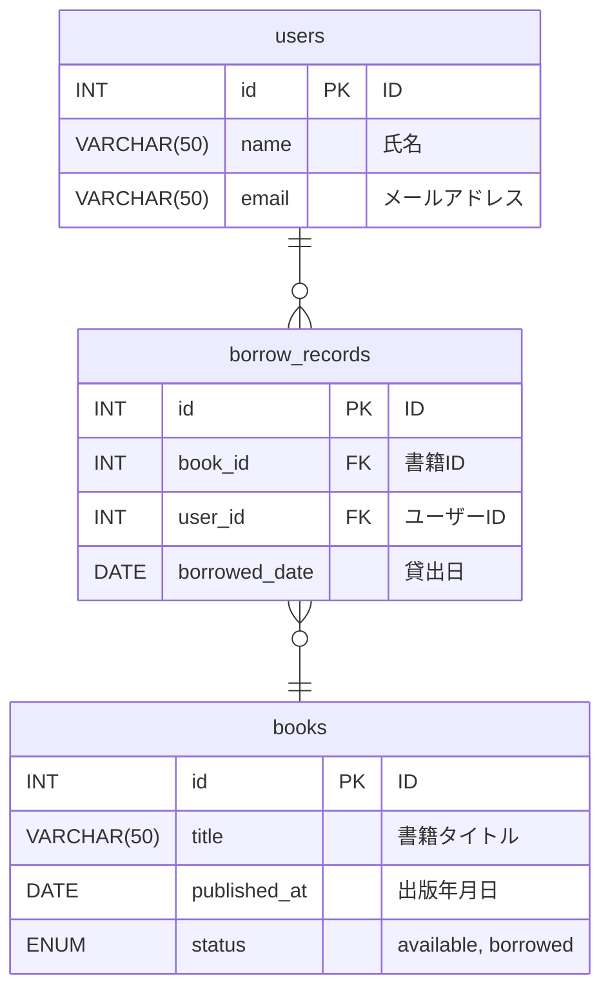

# 📗書籍管理アプリ（🚧 開発停止中 🚧）
## 🔧 使用技術
| 💚 Backend        | 💙 Frontend    | 💛 その他        |
|-------------------|---------------|-----------------|
| Java              | React         | Github Actions  |
| Spring Boot       | Tailwind CSS  | Swagger         |
| Spring Security   | Vite          | JUnit           |
| MyBatis           | React Router  | Maven           |
| MySQL             | TypeScript    | Docker          |

## 🏚 ER図

## ⛩ API
### 🍩 書籍系
- `GET /books` ... 全ての本のリストを取得
- `GET /books/{id}` ... 特定の本の詳細を取得
- `POST /books` ... 新しい本を追加
- `DELETE /books/{id}` ... 特定の本を削除
- `GET /books/popular` ... 人気ランキング
- `GET /books/search?keyword="hoge"` ... 本の検索

### 🙎‍♂️ 会員系
- `GET /users` ... 全ての利用者のリストを取得
- `GET /users/{id}` ... 特定の利用者の詳細を取得
- `POST /users` ... 新しい利用者を登録
- `DELETE /users/{id}` ... 特定の利用者を削除
- `POST /users/image` ... プロフィール写真のアップロード  
- `GET /users/me` ... 認証済みの自分の情報取得
- `DELETE /users/me` ... 認証済みの自分の情報取得

### 📜 貸出記録系
- `GET /borrow_records` ... 全ての貸出記録を取得
- `GET /borrow_records/books` ... 全ての貸出記録を本で取得
- `GET /borrow_records/users` ... 全ての貸出記録を利用者で取得
- `POST /borrow_records` ... 貸出記録を追加（本の貸し出し）
- `PUT /borrow_records/{borrow_record_id}/books/{book_id}` ... 貸出記録を更新（本の返却）

### 🔐 認証系
- `POST /register` ... 新規登録
- `POST /login` ... ログイン
- `POST /logout` ... ログアウト

## 🔫 画面
### 🍉 新規登録

### 🍔 ログイン

### 🥝 マイページ

### 🍡 書籍一覧

### 🐣 書籍の検索

### 🐶 書籍の人気ランキング

### 🌻 【管理者用】 書籍の追加

  
### 🌺 【管理者用】 会員一覧

### 🐷 【管理者用】 貸出記録一覧

